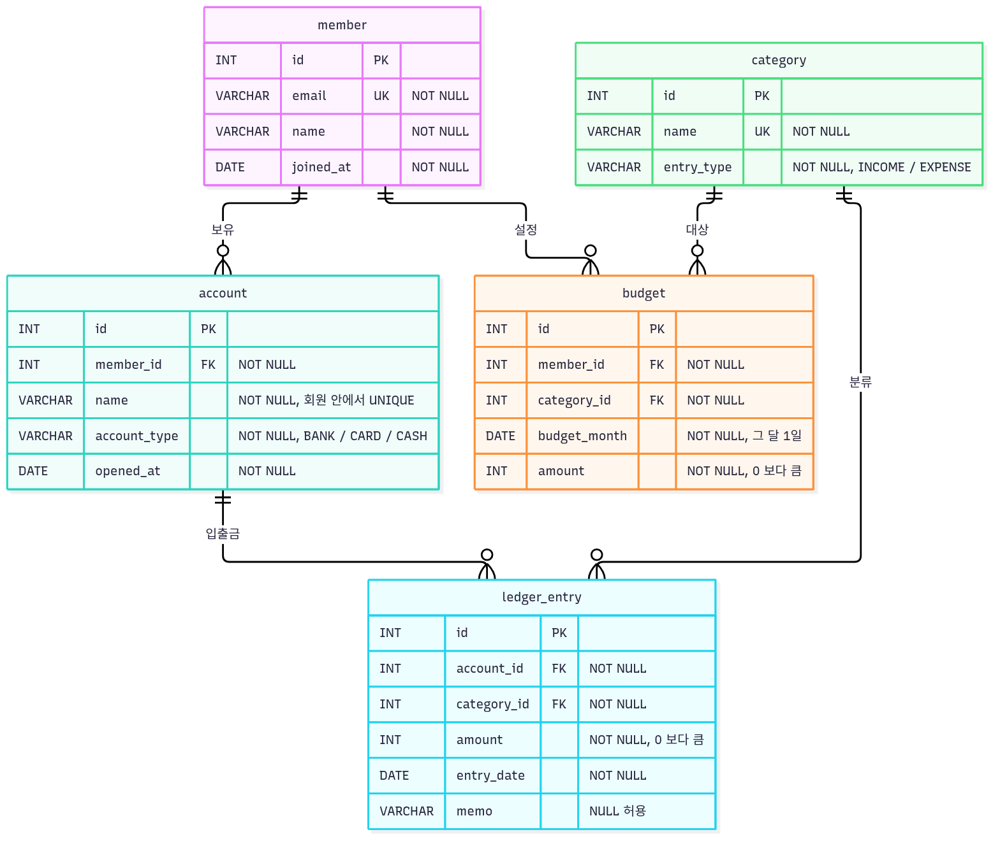

# 14 - 정보를 깔끔하게 정리하는 디지털 서랍장 (SQL Domain Database)

백엔드 프레임워크 없이, 가계부 도메인의 테이블을 직접 설계하고(PK/FK/제약조건) 데이터를 넣고
요구사항을 SQL 로 푸는 전 과정. 결과물은 **SQL 파일 3개 + 실행 결과**다.

- 과제 원문: 로컬 `../14-sql-domain-database.md`

## 선택 사항

| 항목 | 값 | 비고 |
|---|---|---|
| DB | **MySQL 9.7** | 공식 이미지 `mysql:9.7` (Docker Hub `lts` 태그). Docker Compose 로 띄운다 |
| 도메인 주제 | **가계부** | 회원 · 계좌 · 카테고리 · 거래 내역 · 월 예산 |
| 접속 도구 | **CLI** (컨테이너 안 `mysql`) | 로컬에 MySQL 클라이언트를 설치할 필요가 없다. DBeaver 등으로는 `127.0.0.1:3306` 접속 |
| ERD | **Mermaid** | [`docs/erd.md`](docs/erd.md) (GitHub 에서 바로 렌더) → `./run.sh erd` 로 PNG |
| 실행 결과 | **텍스트** | [`results/`](results/) — 이유는 [실행 결과를 텍스트로 남긴 이유](#실행-결과를-텍스트로-남긴-이유) |

## 왜 DB 인가 — 엑셀 한 시트와 비교

같은 가계부를 엑셀 한 시트에 적는 경우와 이 DB 를 나란히 놓으면 이렇다.

| 관점 | 엑셀 한 시트 | 이 DB |
|---|---|---|
| 관계를 저장하는 방식 | 거래 한 줄마다 회원 이름·계좌 이름·카테고리 이름을 글자로 반복해 적는다. 김민준의 생활비카드 거래가 8건이면 `김민준`·`생활비카드` 가 8번 들어간다 | 거래(`ledger_entry`)는 `account_id`·`category_id` 번호만 갖고, 이름은 `member`·`account`·`category` 에 **한 번만** 저장한다. 볼 때 JOIN 으로 합친다(Q05) |
| 값을 고칠 때 | 카테고리 이름을 바꾸면 그 이름이 적힌 행을 모두 찾아 고쳐야 한다. 하나라도 빠지면 같은 카테고리가 두 이름으로 갈라진다 | `category.name` 한 칸만 고치면 그 카테고리의 거래 전부에 반영된다 |
| 잘못된 값 막기 | 칸마다 데이터 유효성 검사를 걸 수는 있지만 붙여넣기로 우회되고, 목록에서 항목을 지울 때 그 값을 쓰는 행이 있는지는 확인하지 않는다 | 저장하는 순간 DB 가 거부한다. 없는 계좌를 가리키는 거래·계좌가 남은 회원의 삭제(FK), 중복 이메일(UNIQUE), 0 이하 금액(CHECK), 빈 필수 칸(NOT NULL) — [FK 오류 예시](#fk-가-실제로-막는-것) |
| 요구사항 조회 | 필터·피벗·VLOOKUP 을 손으로 조합하고, 그 과정은 파일에 남지 않는다 | 요구사항 하나를 SQL 한 문장으로 쓴다. 쿼리가 파일로 남아 누구나 다시 실행할 수 있다(`./run.sh test`) |
| 엑셀이 나은 점 | 설치 없이 바로 열고, 칸을 눌러 고치고, 차트를 쉽게 만든다. 혼자 쓰는 작은 표라면 충분하다 | 스키마 설계와 SQL 이 필요하고, DB 서버(여기선 컨테이너)를 띄워야 한다 |

그래서 테이블을 나눠 저장한다. **같은 사실은 한 곳에만 두고, 테이블 사이의 관계는 FK 번호로 잇는다.**

## 스키마



원본: [`sql/01-schema.sql`](sql/01-schema.sql) · 관계별 실제 데이터 예시: [`docs/erd.md`](docs/erd.md)

| 테이블 | 역할 | PK | FK | 주요 제약 |
|---|---|---|---|---|
| `member` | 회원 | `id` | — | `email` UNIQUE · NOT NULL |
| `category` | 수입/지출 분류 | `id` | — | `name` UNIQUE · `entry_type` ∈ {INCOME, EXPENSE} |
| `account` | 계좌·카드·현금 지갑 | `id` | `member_id → member` | (`member_id`, `name`) UNIQUE · `account_type` ∈ {BANK, CARD, CASH} |
| `ledger_entry` | 거래 내역 (가계부 한 줄) | `id` | `account_id → account` · `category_id → category` | `amount > 0` · `memo` 만 NULL 허용 |
| `budget` | 회원의 월·카테고리별 예산 | `id` | `member_id → member` · `category_id → category` | (`member_id`, `category_id`, `budget_month`) UNIQUE · `budget_month` 는 매월 1일 |

- 테이블 5개, **1:N 관계 5개**(FK 5개). 모든 테이블이 `PRIMARY KEY (id)` 를 가진다.
- 제약조건: `NOT NULL` 22개 컬럼(PK 제외 17개) · `UNIQUE` 4개 · `CHECK` 5개 · FK 5개.
- **PK 는 식별, FK 는 연결.** PK 는 테이블 안에서 행 하나를 가리킨다(거래 35번). FK 는 다른 테이블의 PK 값을 담아 두 행을 잇는다(거래 35번의 `account_id = 2` → 계좌 2번 생활비카드).
- 컬럼 타입: 금액은 원 단위 정수라 `INT`, 날짜는 시각이 필요 없어 `DATE`, 이름·메모는 `VARCHAR`. 길이를 정한 이유는 스키마 파일의 컬럼 주석에 적었다.

### 테이블을 이렇게 나눈 이유

- **`member` / `account`** — 회원 한 명이 계좌를 여러 개 가진다. 한 테이블에 두면 계좌마다 회원 이메일·이름이 반복된다.
- **`category`** — 카테고리 이름과 수입/지출 구분을 한 곳에서 관리한다. 거래마다 `'식비'`·`'EXPENSE'` 를 글자로 적으면 오타 하나로 같은 카테고리가 갈라진다.
- **`ledger_entry` / `budget`** — 거래(실제로 쓴 돈)와 예산(쓰기로 한 돈)은 다른 사실이다. 예산은 회원·카테고리·월마다 하나(UNIQUE)라서 따로 둔다.
- 정규화 이론을 단계별로 적용하기보다 "같은 사실은 한 번만 저장한다"를 기준으로 나눴다(과제 §7 — 정규화를 과도하게 파지 않는다).

### FK 가 실제로 막는 것

MySQL(InnoDB)은 FK 를 항상 검사한다(`./run.sh check` 의 `foreign_key_checks = 1`). 9.7.2 에서 실행한 그대로다.
메시지 속 `` `budget` `` 은 DB 이름(`.env` 의 `MYSQL_DATABASE`)이다.

```text
-- 없는 계좌(999)를 가리키는 거래를 넣으면
INSERT INTO ledger_entry (account_id, category_id, amount, entry_date, memo) VALUES (999, 4, 10000, '2026-09-27', '없는 계좌');
ERROR 1452 (23000) at line 1: Cannot add or update a child row: a foreign key constraint fails (`budget`.`ledger_entry`, CONSTRAINT `fk_ledger_entry_account` FOREIGN KEY (`account_id`) REFERENCES `account` (`id`))

-- 계좌가 남아 있는 회원(1번)을 지우면
DELETE FROM member WHERE id = 1;
ERROR 1451 (23000) at line 1: Cannot delete or update a parent row: a foreign key constraint fails (`budget`.`account`, CONSTRAINT `fk_account_member` FOREIGN KEY (`member_id`) REFERENCES `member` (`id`))
```

## 샘플 데이터

| 테이블 | 행 수 | 비고 |
|---|---|---|
| `member` | 10 | 2명은 계좌 미등록 |
| `category` | 13 | 수입 3 · 지출 10, 2개는 아직 쓰이지 않음 |
| `account` | 12 | 1개는 거래 없음 |
| `ledger_entry` | 47 | 2026-07 ~ 2026-09 |
| `budget` | 12 | 2026-09 10건 · 2026-08 2건 |

부모 테이블부터 넣는다: `member → category → account → ledger_entry → budget`.
`./run.sh check` 결과는 [`results/check.txt`](results/check.txt).

대표 행 (`sql/02-seed.sql` 에서 발췌, 오른쪽 주석은 번호가 가리키는 대상):

```sql
-- ledger_entry (id, account_id, category_id, amount, entry_date, memo)
(1,  1,  1,  3200000, '2026-07-25', '7월 급여'),           -- 김민준 급여통장 · 급여(수입)
(35, 2,  9,   210000, '2026-09-08', '가을 자켓'),          -- 김민준 생활비카드 · 쇼핑(지출)
(46, 3,  4,    35000, '2026-09-26', '장보기 (중복 입력)'), -- 이서연 주거래통장 · 식비 — Q16 이 지우는 중복 거래
```

LEFT JOIN·DELETE 결과가 비지 않도록 일부러 넣은 행도 있다. 계좌 없는 회원 9·10 은 Q07 에,
거래가 한 번도 없는 카테고리(의료·경조사)는 Q08 의 0건 행에, 중복 입력 거래 46 은 Q16 에 쓰인다.

## 쿼리 (16개)

| 범주 | 필요 | 작성 | 쿼리 |
|---|---|---|---|
| 기본 조회 | 4+ | 4 | Q01 기간·금액 조건 TOP 5 · Q02 메모 검색 · Q03 최근 가입자 · Q04 계좌별 최근 거래 |
| 조인 | 4+ (INNER 2+, LEFT 1+) | 4 | Q05 INNER 4테이블 · Q06 INNER 회원-계좌 · Q07 LEFT 계좌 없는 회원 · Q08 LEFT 카테고리별 건수(0 포함) |
| 집계 | 3+ (COUNT/SUM/AVG 2종+, GROUP BY) | 3 | Q09 월별 수입·지출(SUM) · Q10 카테고리별 COUNT·SUM·AVG · Q11 회원별 지출 HAVING |
| 서브쿼리 | 1+ | 2 | Q12 스칼라(평균보다 큰 지출) · Q13 파생 테이블(예산 초과) |
| 수정·삭제 | 2+ | 2 | Q15 UPDATE 재분류 · Q16 DELETE 중복 거래 |
| 인덱스 | 1+ | 1 | Q14 `CREATE INDEX` + 전후 `EXPLAIN` 비교 |

- 과제 최소 합은 15개(4+4+3+1+2+1)다. 서브쿼리를 스칼라(Q12)·파생 테이블(Q13) 두 형태로 보이려고 하나 더 써서 16개다.
- 모든 쿼리 위에 "무엇을 확인하는 쿼리인지" 한 줄 주석이 있다. 여러 단계로 된 Q11·Q13 에는 단계별 주석을 더 달았다.
- MySQL 전용 문법(`LIMIT`, `DATE_FORMAT`, `EXPLAIN FORMAT`, `AUTO_INCREMENT`)은 쓴 자리에 주석으로 표기했다.
- 날짜 조건은 `CURDATE()` 대신 리터럴로 고정 — 언제 실행해도 결과가 같다.
- 실행 결과: [`results/03-queries.txt`](results/03-queries.txt) (`./run.sh test --save` 로 재생성).

### INNER JOIN 과 LEFT JOIN 의 차이

같은 회원-계좌 조인을 두 방식으로 세어 보면 이렇다.

| 조인 | 결과 행 | 나온 회원 | 계좌 칸이 NULL 인 행 |
|---|---|---|---|
| `member INNER JOIN account` (Q06) | 12 | 8명 | 0 |
| `member LEFT JOIN account` | 14 | 10명 | 2 |

```text
| id | name   | account_id | account_name |
|  1 | 김민준 |          1 | 급여통장     |
|  1 | 김민준 |          2 | 생활비카드   |
|  9 | 장서윤 |       NULL | NULL         |   ← INNER 에서는 사라지는 행
| 10 | 임건우 |       NULL | NULL         |
```

- INNER 는 양쪽에 짝이 있는 행만 남긴다. LEFT 는 왼쪽(`member`) 행을 전부 남기고, 짝이 없으면 오른쪽 칸을 NULL 로 채운다.
- Q07 은 이 NULL 행만 골라(`WHERE a.id IS NULL`) 계좌 없는 회원을 찾는다.
- Q08 은 날짜 조건을 WHERE 가 아니라 **ON** 에 둔다. WHERE 에 두면 NULL 로 채운 행이 비교에서 탈락해 9월 거래가 없는 카테고리가 결과에서 사라진다.
  건수는 `COUNT(*)` 가 아니라 `COUNT(e.id)` 로 센다. `COUNT(*)` 는 NULL 로 채운 행도 1 로 세고, `COUNT(e.id)` 는 NULL 을 건너뛴다. 합계는 `COALESCE(SUM(...), 0)` 으로 NULL 대신 0 을 보인다.

### 집계 쿼리의 처리 순서

SQL 은 적힌 순서가 아니라 아래 순서로 처리한 것과 같은 결과를 낸다. 실제로 어떤 순서로 읽을지는 옵티마이저가 정한다.

```text
FROM · JOIN(ON) → WHERE → GROUP BY → (묶음마다 COUNT·SUM·AVG 계산) → HAVING → SELECT → ORDER BY → LIMIT
```

- WHERE 는 **묶기 전** 행을 하나씩, HAVING 은 **묶은 뒤** 묶음을 하나씩 거른다. 그래서 `SUM(e.amount) >= 100000` 같은 집계 조건은 HAVING 에 둔다(Q11). WHERE 에 두면 `ERROR 1111 Invalid use of group function` 이 난다.
- SELECT 의 별칭은 SELECT 단계에서 생긴다. 그래서 ORDER BY 에서는 쓸 수 있지만(Q10 의 `ORDER BY total_amount`), WHERE 에서는 쓸 수 없다(`ERROR 1054 Unknown column`).

### 인덱스 (Q14) 와 복합 인덱스 후보

- **Q14 — `entry_date` 인덱스.** 9/20~30 조회(47행 중 8행)가 `ALL` → `range` 로 바뀐다. 9월 전체(21행)로 비교하면 인덱스를 만든 뒤에도 `ALL` 이다. 조건에 맞는 행이 테이블의 큰 비율이면, 인덱스로 찾은 뒤 행마다 테이블 본체를 다시 읽는 것보다 전체를 한 번 읽는 쪽이 싸다고 옵티마이저가 판단하기 때문이다.
- **복합 인덱스 후보 — `(account_id, entry_date)`.** Q04(계좌별 최근 거래)는 `account_id` 로 거르고 `entry_date` 로 정렬한다. 실측 결과는 이렇다.

  | | 사용한 인덱스 | Extra |
  |---|---|---|
  | 지금 (FK 인덱스만) | `fk_ledger_entry_account` | `Using filesort` — 거른 8행을 따로 정렬한다 |
  | 복합 인덱스 추가 | `idx_ledger_entry_account_date` | `Backward index scan` — 인덱스를 거꾸로 읽어 정렬 단계가 없다 |

  이 인덱스를 만들면 MySQL 이 FK 용으로 자동 생성해 둔 `fk_ledger_entry_account` 를 스스로 지운다. 맨 앞 컬럼이 `account_id` 라 FK 검사를 대신할 수 있기 때문이다(실측). 47행에서는 체감 차이가 없고 과제의 인덱스 요건은 Q14 로 채웠으므로 적용하지는 않았다. 거래가 쌓이면 가장 먼저 넣을 후보다.
- **어떤 컬럼에 거는가.** WHERE·JOIN·ORDER BY 에 자주 쓰이고, 조건으로 **좁게** 거르는 컬럼이다(짧은 기간의 `entry_date`, FK 컬럼). 문자열은 앞 글자 검색(`LIKE '장보기%'`)만 인덱스로 범위를 좁힐 수 있다. Q02 처럼 `LIKE '%커피%'` 로 중간을 찾으면 B-tree 인덱스가 있어도 전체를 읽는다. `memo` 에 인덱스를 걸고 실측하면 `'장보기%'` 는 `range`, `'%커피%'` 는 `ALL` 이다.

## 폴더 구조

```
.
├── sql/
│   ├── 01-schema.sql    # 제출물 1 — CREATE TABLE + PK/FK/제약조건
│   ├── 02-seed.sql      # 제출물 2 — 테이블당 10행 이상 (부모 테이블 먼저)
│   └── 03-queries.sql   # 제출물 3 — 쿼리 16개 + 한 줄 설명
├── results/             # 제출물 4 — 실행 결과 텍스트
│   ├── 03-queries.txt   #   ./run.sh test --save
│   └── check.txt        #   ./run.sh build 직후 ./run.sh check
├── docs/                # (선택) ERD — erd.md(Mermaid 원본·관계별 데이터 예시) · erd.png
├── compose.yaml         # MySQL 9.7 컨테이너 (127.0.0.1 에만 바인딩)
├── .env.example         # 접속 정보 템플릿 — .env 가 없으면 run.sh 가 복사
├── run.sh
└── README.md
```

## 실행

필요한 것: Docker Desktop (Compose v2). MySQL 클라이언트 설치는 필요 없다.

```bash
./run.sh up           # MySQL 컨테이너 기동 (healthy 까지 대기, 첫 기동은 이미지 다운로드)
./run.sh build        # DB 재생성 → 01-schema → 02-seed
./run.sh test         # build 후 03-queries 실행 결과 출력 (--save 면 results/ 에 저장)
./run.sh check        # 과제 정량 요건 점검 (테이블·PK·FK·NOT NULL·UNIQUE·행 수)
./run.sh run          # mysql 대화형 셸
./run.sh erd          # docs/erd.md → docs/erd.png
./run.sh down [-v]    # 컨테이너 정리 (-v 면 데이터 볼륨까지)
```

- `test` 는 매번 `build` 부터 다시 한다 — 쿼리 파일에 UPDATE/DELETE 가 있어도 몇 번을 돌리든 같은 결과가 나온다.
- 포트를 바꾸려면 `.env` 의 `MYSQL_PORT` 를 고친다.

### 실행 결과를 텍스트로 남긴 이유

과제는 결과를 "스크린샷(또는 결과 텍스트)"로 남기라고 한다(과제 §2-4 · §4). 이 레포는 **결과 텍스트**를 택했다.

- [`results/03-queries.txt`](results/03-queries.txt) — 쿼리 16개마다 설명 주석, SQL 원문, 결과표, 영향받은 행 수(`2 rows affected` 등)를 실행 순서대로 담았다.
- [`results/check.txt`](results/check.txt) — 과제 정량 요건 점검 결과.
- 텍스트라서 결과를 **검증**할 수 있다. `./run.sh test | diff - results/03-queries.txt` 가 아무것도 출력하지 않으면 지금 실행한 결과가 제출한 결과와 한 글자도 다르지 않다는 뜻이다. 쿼리를 고치면 `--save` 로 다시 만들고 `git diff` 로 무엇이 바뀌었는지 본다.

## 작업 중 부딪힌 문제와 해결

| 문제 | 원인 | 해결 | 근거 |
|---|---|---|---|
| 실행 결과를 다시 뽑을 때마다 diff 가 생긴다 | `mysql -vvv` 가 쿼리마다 실행 시간 `(0.00 sec)` 을 찍고, 주석만 있는 블록을 `Query OK, 0 rows affected` 로 출력한다 | `run.sh` 의 `tidy()` 가 실행 시간을 지우고 주석 블록을 정리한다 | 커밋 `863afeb` · `954fa43` |
| 두 번째 실행부터 결과가 달라진다 | Q15(UPDATE)·Q16(DELETE)가 DB 를 바꾼다 | `test` 는 매번 DB 를 새로 만든 뒤 실행하고, 수정·삭제 쿼리는 파일 맨 끝에 둔다 | `run.sh` 의 `cmd_test` |
| 실행하는 날에 따라 결과가 바뀔 수 있다 | `CURDATE()` 기준 조건은 실행한 날짜에 따라 대상이 달라진다 | 날짜 조건을 리터럴(`'2026-09-01'` 등)로 고정했다 | 커밋 `0ab858f` |
| EXPLAIN 에 `type`·`key` 열이 나오지 않는다 | MySQL 9.x 는 기본 EXPLAIN 형식이 TREE 다(`@@explain_format = TREE`, 9.7.2 실측) | Q14 에 `EXPLAIN FORMAT=TRADITIONAL` 을 명시했다 | Q14 주석 |
| 인덱스를 만들었는데 9월 전체 조회는 여전히 `ALL` 이다 | 47행 중 21행(45%)이 조건에 맞아 전체를 읽는 쪽이 싸다고 판단한다 | 비교 범위를 9/20~30(8행)으로 좁혀 `ALL → range` 를 확인했다 | Q14 주석 |
| 랭킹 쿼리의 순서가 보장되지 않는다 | Q10 에서 카페·문화가 22000 원으로 동점인데 `ORDER BY` 기준이 하나뿐이었다 | 두 번째 정렬 기준(id)을 추가했다. 같은 구조인 Q11·Q13 도 보강했다 | 커밋 `f05c887` |
| `check.txt` 의 거래 수(46)가 README·시드(47)와 다르다 | `check` 를 `test`(Q16 이 1건 삭제) 뒤에 돌렸다 | `build` 직후 `check` 로 다시 만들었다 | 커밋 `f898ae6` |
| "예산은 지출 카테고리에만" 규칙을 CHECK 로 걸 수 없다 | CHECK 는 같은 행의 값만 볼 수 있는데, 수입/지출 구분은 `category` 테이블에 있다 | 트리거는 과제 범위 밖(§7)이라 입력하는 쪽이 지키기로 하고 스키마 주석에 적었다. 시드는 지출 카테고리에만 예산을 건다 | `01-schema.sql` 의 `budget` 주석 |

## 범위 밖 (과제 §7 명시)

- **백엔드 프레임워크 금지** — Spring/Django/Express 로 API·화면을 만들지 않는다
- 뷰(View) · 프로시저 · 트리거 사용하지 않는다
- 정규화 이론을 깊게 파지 않는다 (관계가 자연스럽고 쿼리가 잘 나오는 구조를 목표로)

## 제출물 체크리스트

- [x] `sql/01-schema.sql` — 스키마 생성 SQL 1개 파일
- [x] `sql/02-seed.sql` — 샘플 데이터 INSERT SQL 1개 파일 (테이블당 10행 이상)
- [x] `sql/03-queries.sql` — 쿼리 16개 SQL 1개 파일
- [x] `results/` — 실행 결과 텍스트 폴더
- [x] (선택) `docs/erd.png` — ERD 다이어그램
