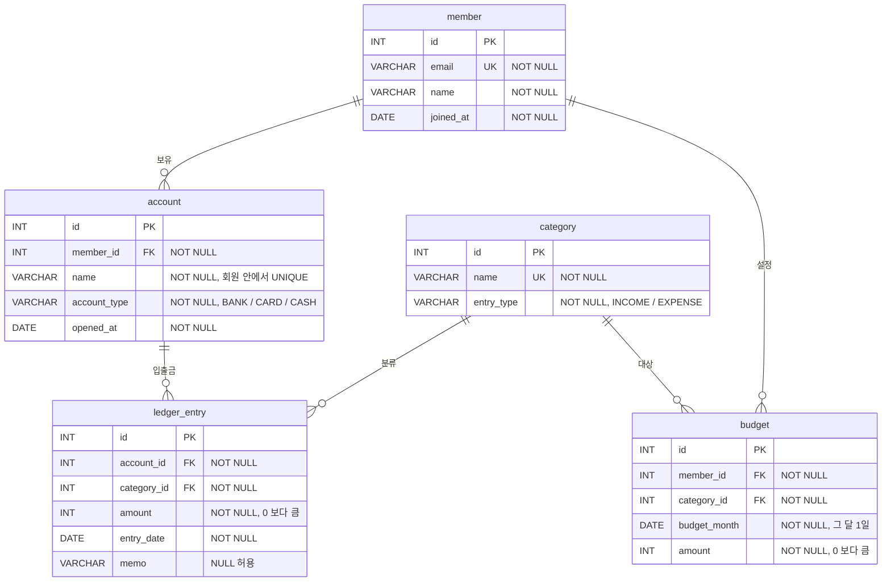

# ERD — 가계부

`./run.sh erd` 로 아래 mermaid 블록을 `erd.png` 로 뽑는다. GitHub 에서는 블록이 바로 그림으로 보인다.
원본 스키마는 [`sql/01-schema.sql`](../sql/01-schema.sql).

| 관계 | 부모 (1) | 자식 (N) | FK |
|---|---|---|---|
| 회원이 계좌를 여러 개 가진다 | `member` | `account` | `account.member_id` |
| 계좌에서 거래가 여러 번 오간다 | `account` | `ledger_entry` | `ledger_entry.account_id` |
| 카테고리 하나로 거래 여러 건을 분류한다 | `category` | `ledger_entry` | `ledger_entry.category_id` |
| 회원이 월·카테고리별 예산을 여러 개 세운다 | `member` | `budget` | `budget.member_id` |
| 카테고리 하나에 예산이 여러 개 걸린다 | `category` | `budget` | `budget.category_id` |

샘플 데이터(`sql/02-seed.sql`)에서 각 관계가 실제로 어떻게 이어지는지:

| 관계 | 부모 행 하나 | 그 부모를 가리키는 자식 행 |
|---|---|---|
| `member` → `account` | 회원 1 김민준 | 계좌 1 급여통장 · 2 생활비카드 (2개) |
| `account` → `ledger_entry` | 계좌 2 생활비카드 | 거래 5 · 6 · 17 · 18 · 31 · 32 · 34 · 35 (8건) |
| `category` → `ledger_entry` | 카테고리 4 식비 | 거래 5 · 9 · 17 · 20 · 31 · 34 · 36 · 41 · 45 · 46 (10건) |
| `member` → `budget` | 회원 1 김민준 | 예산 1 · 2 · 3 (9월) · 11 · 12 (8월) (5건) |
| `category` → `budget` | 카테고리 4 식비 | 예산 1 · 4 · 6 · 9 (회원 1·2·3·5 의 9월) · 11 (회원 1 의 8월) (5건) |

반대 방향은 항상 하나다. 거래 35(가을 자켓)는 `account_id = 2` 하나, `category_id = 9`(쇼핑) 하나만 가진다.
이 "자식 → 부모는 하나, 부모 → 자식은 여럿" 이 1:N 이다.
